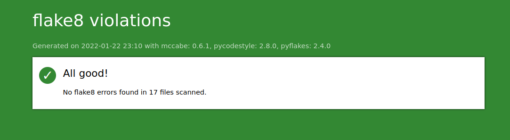

# DA_Python_P04 - Gestionnaire de tournois d'échecs

Développez un programme logiciel en Python

# Table des matières<a name="Table_of_Contents"></a>
- [DA_Python_P04 - Gestionnaire de tournois d'échecs](#da_python_p04---gestionnaire-de-tournois-déchecs)
- [Table des matières<a name="Table_of_Contents"></a>](#table-des-matières)
  - [INTRODUCTION <a name="INTRODUCTION"></a>](#introduction-)
  - [Objectifs du projet <a name="objectifs"></a>](#objectifs-du-projet-)
  - [FEATURES <a name="FEATURES"></a>](#features-)
  - [REQUIREMENTS <a name="REQUIREMENTS"></a>](#requirements-)
    - [Récupération du projet <a name="Recup_projet"></a>](#récupération-du-projet-)
    - [Création d'un environnement virtuel Python <a name="Env_Virtuel_Python"></a>](#création-dun-environnement-virtuel-python-)
    - [Installation des packages Python nécessaire <a name="Installation_package"></a>](#installation-des-packages-python-nécessaire-)
  - [Comment utiliser le programme <a name="How_to_use"></a>](#comment-utiliser-le-programme-)
  - [Exemple d'affichage du menu principal <a name="Exemple_affichage_menu"></a>](#exemple-daffichage-du-menu-principal-)
  - [Arborescence du projet <a name="Tree_project"></a>](#arborescence-du-projet-)
  - [Base de données <a name="DB"></a>](#base-de-données-)
  - [Menu principal <a name="Menu_principal"></a>](#menu-principal-)
  - [Création d'un nouveau joueur <a name="Create_player"></a>](#création-dun-nouveau-joueur-)
  - [Création d'un nouveau tournois <a name="Create_tournoi"></a>](#création-dun-nouveau-tournois-)
  - [Recharger un tournois existant <a name="Import_tournoi"></a>](#recharger-un-tournois-existant-)
  - [Rapports sur les joueurs <a name="Repport_players"></a>](#rapports-sur-les-joueurs-)
  - [Rapports sur les tournois <a name="Repport_tournois"></a>](#rapports-sur-les-tournois-)
  - [Utilisation de flake8 <a name="Flake8"></a>](#utilisation-de-flake8-)
    - [Inscructions pour générer un nouveau rapport flake8-html.](#inscructions-pour-générer-un-nouveau-rapport-flake8-html)
  - [Contact <a name="Contact"></a>](#contact-)


## INTRODUCTION <a name="INTRODUCTION"></a>

Ce programme répond aux besoins d'un club d'échecs qui souhaite gérer un tournoi d'échecs. Le programme est exécuté en local, il n'y a donc pas besoin d'avoir une connexion internet. Les informations sont sauvegardées dans une base de données, les informations relatifs au tournois sont donc persistante. Il est possible de reprendre un tournois en cours et d'afficher différents rapports.
Ce programme gère les tournois selon le système de tournoi "suisse". 


## Objectifs du projet <a name="objectifs"></a>

L'objectif est d'offrir une solution au club d'échecs pour la gestion de leurs tournois en mode hors ligne pour éviter les problèmes de déconnexion. Le programme assistera le gestionnaire du tournoi dans diverses tâches comme l'inscription des joueurs selon leur identité, leur date de naissance, leur sexe, leur classement et leurs scores durant les matchs.
Il est aussi possible de créer des tournois et d'importer un tournoi déjà existant. Le gestionnaire aura la possibilité de rajouter des joueurs déjà existant dans la base de données au tournoi ou d'en rajouter des nouveaux. Toutes les informations ajoutées sont persistantes dans une base de données en local.
Le programme doit gérer automatiquement les matchs du tournoi en créant les paires de joueurs selon le système "suisse". Le programme doit aussi permettre d'afficher différents rapports concernant les joueurs et les tournois. Le programme devra permettre au gestionnaire du tournoi de pouvoir rentrer les scores et éventuellement changer le classement des joueurs à n'importe quel moment.


[<div align="center">[Table of Contents]</div>](#Table_of_Contents) 

## FEATURES <a name="FEATURES"></a>

  - Création des joueurs.
  - Création de tournois.
  - Ajouter des joueurs existants à un tournoi.
  - Ajouter de nouveaux joueur à un tournoi.
  - Créations des paires de joueurs de façon automatique selon le système "suisse".
  - Affichage des rapports ordonnés pour les joueurs.
  - Affichage des rapports ordonnés de tournois (participants, rondes, matchs)
  - Sauvegarde des données en base de données.
  - Importation des données depuis la base de données.
  - Changement du classement des joueurs de façon manuelle.
  - Saisie des résultats des matchs et calcul automatique des scores.
  - Possibilité de choisir le nombre de ronde (4 par défaut) et de joueur (8 par défaut) pour un tournoi.


[<div align="center">[Table of Contents]</div>](#Table_of_Contents)

## REQUIREMENTS <a name="REQUIREMENTS"></a>
  - Pour l'exécution du programme, une version de Python d'au moins v3.8.X ou plus récente est recommandée.
  - Il est recommandé d'utiliser un environnement virtuel Python et d'installer les packages présents dans le fichier "requirements.txt" (une procédure plus bas vous détaillera cette installation).
  - Il est recommander de récupérer le projet en utilisant "git clone" ou en téléchargeant directement le projet.
  - Une connexion internet fonctionnelle est nécessaire pour la partie installation.


### Récupération du projet <a name="Recup_projet"></a>

- Par téléchargement:
  
 lien de téléchargement : https://github.com/lahou-sys/DA_Python_P04/archive/refs/heads/master.zip

- Par "git clone":
  
```ssh
git clone https://github.com/lahou-sys/DA_Python_P04.git
```


[<div align="center">[Table of Contents]</div>](#Table_of_Contents) 

### Création d'un environnement virtuel Python <a name="Env_Virtuel_Python"></a>

Se positionner dans le dossier qui héberge le projet.

Si le module python "venv" n'est pas installé sur votre système, il est nécessaire de l'installer comme ci-dessous :

  - Installation du module "venv"

```ssh
$ pip install venv
```

  - Création de l'environnement virtuel Python

```ssh
$ python3 -m venv .venv
```

  - Activation de l'environnement virtuel Python

```ssh
$ source ./.venv/bin/activate
```

[<div align="center">[Table of Contents]</div>](#Table_of_Contents) 

### Installation des packages Python nécessaire <a name="Installation_package"></a>

l'installation de ces packages sont nécessaire pour la bonne éxécution du script.

```ssh

Package            Version
------------------ -------
autopep8           1.6.0
flake8             4.0.1
flake8-html        0.4.1
importlib-metadata 4.10.0
Jinja2             3.0.3
MarkupSafe         2.0.1
mccabe             0.6.1
pip                21.3.1
pycodestyle        2.8.0
pyflakes           2.4.0
Pygments           2.11.2
setuptools         49.2.1
six                1.16.0
tinydb             4.5.2
toml               0.10.2
zipp               3.7.0
```


    - Installation automatique des packages

```ssh
$ pip install -r requirements.txt
```


[<div align="center">[Table of Contents]</div>](#Table_of_Contents) 


## Comment utiliser le programme <a name="How_to_use"></a>

Une fois l'environnement virtuel Python créé et activé, ainsi que l'installation des packages nécessaires installés.

Vous pouvez lancer le programme :

```ssh
$ python3 main.py
```

[<div align="center">[Table of Contents]</div>](#Table_of_Contents) 

## Exemple d'affichage du menu principal <a name="Exemple_affichage_menu"></a>

```ssh


                                                           @@
                                                        .@@@@@@#
                                                      @@@@@@@@@@@@
                                                   .@@@@@@@  #@@@@@@#
                                                 @@@@@@@@@    %@@@@@@@@
                                 .@@@.         @@@@@@@@@,       @@@@@@@@@(         @@@#
                               @@@@@@@@@    @@@@@@@@@@@@@      @@@@@@@@@@@@@    %@@@@@@@@
                             %@@@@@@@@@@@&%@@@@@@@@@@@@@@@    %@@@@@@@@@@@@@@@/@@@@@@@@@@@@
                                @@@@@@@      @@@@@@@@@@@%      *@@@@@@@@@@@*     @@@@@@@*
                                  %@&          %@@@@@@@@@@    @@@@@@@@@@@          /@@
                                  @@@          @@@@@@@@@@@.   @@@@@@@@@@@          &@@
                               ,@@@@@@@/    ,@@@@@@@@@@@@@    @@@@@@@@@@@@@&     @@@@@@@%
                             @@@@@@@@@@@@@@@@@@@@@@@@@@@@@    /@@@@@@@@@@@@@@@@@@@@@@@@@@@@
                               %@@@@@@@&    #@@@@@@@@@@@#      /@@@@@@@@@@@@    ,@@@@@@@@
                                  @@@          @@@@@@@&          @@@@@@@@,         @@@,
                                                 #@@@@@          &@@@@@
                                                    @@@@@@@@@@@@@@@@,
                                                      #@@@@@@@@@@@
                                                         @@@@@@,
                                                           #@

                                                           **                                                          

                                                  ** CLUB D'ECHECS **                                                  

                                               ** GESTION DE TOURNOIS **                                               

                                                           **                                                          
Date: 23/01/2022

=======================================================================================================================
                                                   * MENU PRINCIPAL*                                                   
1. Ajouter un nouveau joueur
2. Créer un tournoi
3. Reprendre avec un tournoi existant
4. Afficher la liste des joueurs
5. Afficher la liste des tournois
0. Quitter le programme
=======================================================================================================================
Choisissez ce que vous souhaitez faire :
```
Au lancement du programme, vous arrivez sur le menu principal, vous pouvez faire votre choix en tapant le numéro de l'option qui vous intéresse et ensuite taper sur "ENTRER".

[<div align="center">[Table of Contents]</div>](#Table_of_Contents)

## Arborescence du projet <a name="Tree_project"></a>

Voici l'arborescence du projet, elle respecte le concept MVC.

Arborescence générale du projet:

```ssh
.
├── controllers
├── db
├── flake-report
├── logo
├── main.py
├── models
├── README.md
├── requirements.txt
├── utils
└── views
```

Arborescence des contrôleurs:

```ssh
./controllers/
├── abstract.py
├── database
│   ├── players.py
│   └── tournaments.py
├── launcher.py
├── players.py
└── tournaments.py
```

Arborescence des modèles:

```ssh
./models/
├── match.py
├── participant.py
├── player.py
├── round.py
└── tournament.py
```

Arborescence des vues:

```ssh
./views/
├── abstract.py
├── player.py
├── round.py
└── tournament.py
```

Arborescence de la base de données:

```ssh
./db
└── db.json
```

Arborescence des outils:

```ssh
./utils/
└── utils.py
```

Arborescence logo:

```ssh
./logo/
└── ascii-art.txt
```


[<div align="center">[Table of Contents]</div>](#Table_of_Contents)


## Base de données <a name="DB"></a>

Une nouvelle base de données est créee au premier lancement du programme.
la solution Tinydb est utilisée dans ce projet comme base de données, elle répond parfaitement aux besoins du projet.

Arborescence du ficher de la base de données:

```ssh
./db
└── db.json
```

Dans le projet, deux contrôleurs existes pour la sauvegarde, les mises à jour, et la recherche des informations dans la base de données.
Un pour les tournois et un autre pour les joueurs.

Arborescence des contrôleurs:

```ssh
./controllers/
├── database
│   ├── players.py
│   └── tournaments.py
...

```

[<div align="center">[Table of Contents]</div>](#Table_of_Contents)


## Menu principal <a name="Menu_principal"></a>

Au lancement du programme, c'est le menu principal qui s'affiche.
Lors de l'utilisation du programme, il sera possible de revenir sur ce manu à partir des autres sous menus.

Menu principal :

```ssh
1. Ajouter un nouveau joueur
2. Créer un tournoi
3. Reprendre avec un tournoi existant
4. Afficher la liste des joueurs
5. Afficher la liste des tournois
0. Quitter le programme
```
- Option 1 : création d'un nouveau joueur dans la base de données.
- Option 2 : création d'un nouveau trounoi.
- Option 3 : chargement d'un tournoi existant en base de données.
- Option 4 : rapports sur les joueurs en base de données.
- Option 5 : rapports sur les tournois en base de données.
- Option 0 : Pour quitter le programme.
  
[<div align="center">[Table of Contents]</div>](#Table_of_Contents)


## Création d'un nouveau joueur <a name="Create_player"></a>

A partir de l'option 1 du menu principal, nous arrivons sur la procédure de création d'un nouveau joueur.

Example de saisie pour l'ajout d'un nouveau utilisateur après le choix de l'ption 1 du menu principal.

```ssh
================================================================================
Choisissez ce que vous souhaitez faire :1

Veuillez saisir le prénom du joueur: Jean
le prénom du joueur est : Jean
Confirmez-vous cela ? (Y/N): y

Veuillez saisir le nom du joueur: Durand
le nom du joueur est : Durand
Confirmez-vous cela ? (Y/N): y

Veuillez saisir la date de naissance du joueur (JJ/MM/AAAA) : 12/01/1980
la date de naissance du joueur est : 12/01/1980
Confirmez-vous cela ? (Y/N): y

Veuillez saisir le sexe du joueur (M/F): M
Le sexe du joueur est : M
Confirmez-vous cela ? (Y/N): y

Veuillez saisir le rang du joueur: 4
le rang du joueur est : 4
Confirmez-vous cela ? (Y/N): y

Jean Durand a bien été ajouté à la base de données
================================================================================
```
A noter que le programme demande une confirmation après chaque saisie en cas de faute de frappe.
Si vous ne validez pas en tapant "N", il vous propose de refaire la saisie.

A noter aussi qu'il y a une vérification dans ce qui a été saisi par exemple le nom et prénom n'accepte pas de caractère spécial et n'est de chaîne de vide.
Pour la date de naissance, il y a aussi une vérification sur le format de date rentré et sur la postériorité de la date à celle du jour.


## Création d'un nouveau tournois <a name="Create_tournoi"></a>

A partir de l'option 2 du menu principal, nous arrivons sur la procédure de création d'un nouveau tournoi.

Example de saisie pour l'ajout d'un nouveau tournoi après le choix de l'ption 2 du menu principal.

```ssh
================================================================================
Choisissez ce que vous souhaitez faire :2

Veuillez saisir le nom du tournoi: Tournois_01
le nom du tournoi est : Tournois_01
Confirmez-vous cela ? (Y/N): y

Veuillez saisir la localisation du tournoi: Paris
la localisation du tournoi est : Paris
Confirmez-vous cela ? (Y/N): y

Veuillez saisir la date du début du tournoi (JJ/MM/AAAA) : 12/01/2022
la date du début du tournoi est : 12/01/2022
Confirmez-vous cela ? (Y/N): y

Veuillez saisir la date de fin du tournoi (JJ/MM/AAAA) : 15/01/2022
la date de fin du tournoi est : 15/01/2022
Confirmez-vous cela ? (Y/N): y

Veuillez saisir la description du tournoi: Tournois Paris
la description du tournoi est : Tournois Paris
Confirmez-vous cela ? (Y/N): y

Voici les différents choix possibles : 
1. Bullet
2. Blitz
3. Coup rapide
Quel time control souhaitez vous choisir ? :1
Confirmez-vous cela ? (Y/N): y

Veuillez saisir le nombre de tours ou laisser vide (4 par défaut): 
Le nombre de tours est 4 (la valeur par défaut).
4
Confirmez-vous cela ? (Y/N): y

Veuillez saisir le nombre de joueur (nombre paire) ou laisser vide (8 par défaut): 
le nombre de joueur est 8 (la valeur par défaut).
8
Confirmez-vous cela ? (Y/N): y

Le tournoi TOURNOIS_01 a été crée avec succès

Quelle action souhaitez vous effectuer ?
1. Ajouter des joueurs.
2. Afficher la liste des participants par classement.
3. Afficher la liste des participants par ordre alphabétique.
0. Quitter le tournoi.

Choisissez ce que vous souhaitez faire :0
================================================================================
```
A noter que le programme demande une confirmation après chaque saisie en cas de faute de frappe.
Si vous ne validez pas en tapant "N", il vous propose de refaire la saisie.

Comme pour la création d'un joueur, il y a une vérification au niveau des saisies, particulièrement sur les dates de début et de fin d'un tournois.
Par exemple la date de fin du torunoi ne peut pas être postérieure à la date de début.

A noter aussi qu'à la fin de la création du tournoi, un sous menu vous propose d'ajouter des joueurs au tournoi et aussi d'afficher ses participants.
Dans notre cas, nous pouvons quitter le tournois et revenir lorsque nous le souhaitons pour rajouter des joueur à ce tournois qui est maintenant sauvegardé en base de données. 

[<div align="center">[Table of Contents]</div>](#Table_of_Contents)


## Recharger un tournois existant <a name="Import_tournoi"></a>

Grâce à l'option 3 du menu principal, il est possible de charger un tournois existant en base de données.

Si ce n'est pas le cas, le programme vous indiquera qu'aucun tournoi n'existe en base de données.
Sinon il vous affichera la liste des tournois en vous demandant de faire sélectionner le tournois à importer.

Voici un example:

```ssh
=======================================================================================================================
Choisissez ce que vous souhaitez faire :3

============================================================================================================================================
 Id  |       Nom       |       Lieu      | Date de début |  Date de fin  |  Time control |  Nbre de tours  | Nbre joueur max | Description     
********************************************************************************************************************************************
 1   |    TOURNOIS01   |      Paris      |   12/01/2022  |   12/01/2022  |     Bullet    |        4        |     8           |    ABCD        
--------------------------------------------------------------------------------------------------------------------------------------------
[...]

 13  |   TOURNOIS_01   |      Paris      |   12/01/2022  |   15/01/2022  |     Bullet    |        4        |     8           |Tournois Paris   
--------------------------------------------------------------------------------------------------------------------------------------------

Utiliser un tournoi déjà existant
Veuillez saisir l'id du tournoi: 13
l'id du tournoi est : 13
Confirmez-vous cela ? (Y/N): y

============================================================================================================================================
 Id  |       Nom       |       Lieu      | Date de début |  Date de fin  |  Time control | Nbre de tours  | Nbre joueur max |  Description     
********************************************************************************************************************************************
 13  |   TOURNOIS_01   |      Paris      |   12/01/2022  |   15/01/2022  |     Bullet    |        4       |       8         | Tournois Paris   
--------------------------------------------------------------------------------------------------------------------------------------------

Le tournoi TOURNOIS_01 a correctement été trouvé et importé !

Quelle action souhaitez vous effectuer ?
1. Ajouter des joueurs.
2. Afficher la liste des participants par classement.
3. Afficher la liste des participants par ordre alphabétique.
0. Quitter le tournoi.
Choisissez ce que vous souhaitez faire :

```
Nous choisisons celui que nous venons de créer gâce à son Id (13).

Il nous affiche les infos du tournoi importé et nous propose un sous menu comme après sa création.

A noter, tant que les joeurs requis ne sont pas rajouter, le tournoi ne peut pas commencer.

Dès que l'ajout de tous les joueurs terminé, le menu va changer en nous proposant de commencer le tournois.


[<div align="center">[Table of Contents]</div>](#Table_of_Contents)


## Rapports sur les joueurs <a name="Repport_players"></a>

Avec l'option 4 du menu principal, il est possible d'afficher des rapports sur les joueurs existants en base de données.


Voici un example (extrait):

```ssh
=======================================================================================================================
Choisissez ce que vous souhaitez faire :4

=======================================================================================================================
    ID     |           Prénom          |            Nom            |  Date de naissance   |    Sexe    | Classement
***********************************************************************************************************************
[...]
-----------------------------------------------------------------------------------------------------------------------
    8      |            Anna           |          CHOCOLAT         |      26/11/2016      |     F      |     3     
-----------------------------------------------------------------------------------------------------------------------
[...]
-----------------------------------------------------------------------------------------------------------------------
    17     |            Jean           |           DAVID           |      01/02/1999      |     M      |     4     
-----------------------------------------------------------------------------------------------------------------------
[...]
-----------------------------------------------------------------------------------------------------------------------
    22     |            Jean           |           BENOIT          |      12/12/2000      |     M      |     3     
-----------------------------------------------------------------------------------------------------------------------
[...]
-----------------------------------------------------------------------------------------------------------------------
    39     |            Jean           |           DURAND          |      12/01/1980      |     M      |     4     
-----------------------------------------------------------------------------------------------------------------------
=======================================================================================================================
                                                    * MENU PLAYERS*                                                    
1. Ajouter un joueur.
2. Modifier le classement d'un joueur.
3. Afficher par classement.
4. Afficher par ordre alphabétique.
0. Retour au menu principal.

=======================================================================================================================
Choisissez ce que vous souhaitez faire :

```

La liste des joueurs existants dans la base de données s'affiche, un sous menu nous propose plusieurs options; nous avons la possibilité de rajouter un nouveau joueur, de modifier le classement d'un joueur, d'afficher les joueurs par ordre de classement ou alphabétique.


[<div align="center">[Table of Contents]</div>](#Table_of_Contents)


## Rapports sur les tournois <a name="Repport_tournois"></a>

Avec l'option 5 du menu principal, il est possible d'afficher des rapports sur les tournois existants en base de données.

Voici un example (extrait):

```ssh
Choisissez ce que vous souhaitez faire :5

============================================================================================================================================
 Id  |       Nom       |       Lieu      | Date de début |  Date de fin  |  Time control | Nbre de tours | Nbre joueur max |  Description     
********************************************************************************************************************************************
[...]
--------------------------------------------------------------------------------------------------------------------------------------------
 13  |   TOURNOIS_01   |      Paris      |   12/01/2022  |   15/01/2022  |     Bullet    |        4        |     8         | Tournois Paris   
--------------------------------------------------------------------------------------------------------------------------------------------

============================================================================================================================================
                                                  * MENU TOURNAMENTS*                                                  
1. Importez un tournoi.
0. Retour au menu principal.

============================================================================================================================================
Choisissez ce que vous souhaitez faire :
```

La liste des tournois existants dans la base de données s'affiche, un sous menu nous propose d'importer un tournoi existant.

Une fois le tournoi importé, le sous menu des tournois s'affichera.

[<div align="center">[Table of Contents]</div>](#Table_of_Contents)


## Utilisation de flake8 <a name="Flake8"></a>

flake8 est un des outils mis à disposition par la communauté pour aider à valider son code Python au regard de la PEP 8.

Un fichier de configuration est présent dans l'arborescence du projet.

Fichier de configuration: .flake8

Contenu du fichier:

```ssh
[flake8]
exclude = .env/
max-line-length = 119
format= html
htmldir= flake-report

```

### Inscructions pour générer un nouveau rapport flake8-html.

Exécution de flake8:

Se positionner dans le dossier du projet et s'assurer que l'environnement virtuel python est chargé.
Exécuter la commande suivante:

```ssh

$ flake8

```

Dossier du rapport flake8:

```ssh
flake-report/
├── back.svg
├── file.svg
├── index.html
└── styles.css
```
Exemple de rapport sans erreur:



[<div align="center">[Table of Contents]</div>](#Table_of_Contents)


## Contact <a name="Contact"></a>

Mail : lbenmoulay@gmail.com